# 简介
这个项目是一个简单的教务查询系统，其中有三种角色：管理员，教师，学生。三种角色都有相应的权限，其中：  
* 管理员：对课程、学生信息、教师信息等进行增删改查，修改个人密码，修改学生和教师的密码
* 教师：可以查看自己教授的课程，查询选修该课程的学生，对选修该课程的学生进行打分，修改个人密码
* 学生：可以进行选课，查看已修课程，查看已选课程，退选课程，修改个人密码

# 使用技术
Web框架：SpringBoot

ORM框架：Mybatis

安全框架：Shiro

分页插件：PageHelper

连接池：SpringBoot自带的HiKariCP

日志：SpringBoot自带的LogBack

前端框架：Bootstrap

# 在线预览
[http://23188i98c9.51mypc.cn:28070](http://23188i98c9.51mypc.cn:28070)
* 登录账户
  * 管理员账户：admin
  * 老师账户：1001
  * 学生账户：10001
  * 密码均为：123

# 快速上手
### 1、运行环境和所需工具
* 编译器：IntelliJ IDEA
* 项目构建工具：Maven
* 数据库：Mysql、Redis
* JDK版本：jdk1.8
* Tomcat版本：Tomcat8.x

### 2、初始化项目
* 在你的Mysql中，创建一个数据库名称为 EducationalManagementSystem 的数据库，并导入我提供的 .sql 文件。
* 进入src/main/resources修改application.properties配置文件,把数据库登录名和密码，改为你本地的。
* 使用 IntelliJ IDEA 导入项目，选择Maven项目选项，一路点击next就行。
* 在 IntelliJ IDEA 中，运行SpringBoot启动类。
* 运行

# 功能模块介绍
### 1、登录模块功能
使用Shiro权限管理框架，实现登录验证和登录信息的储存，根据不同的登录账户，分发权限角色，对不同页面url进行角色设置
### 2、管理员模块功能
管理员可对课程、学生信息、教师信息等进行增删改查，修改个人密码，修改学生和教师的密码
* 课程管理：当课程已经有学生选课成功时，将不能删除
* 学生管理：添加学生信息时，其信息也会添加到登录表中
* 教师管理：添加教师信息时，其信息也会添加到登录表中
* 账户密码重置：修改学生和教师的密码，不需要输入旧密码
* 修改密码：修改自己的密码，需要输入旧密码

* **所有学生信息：**
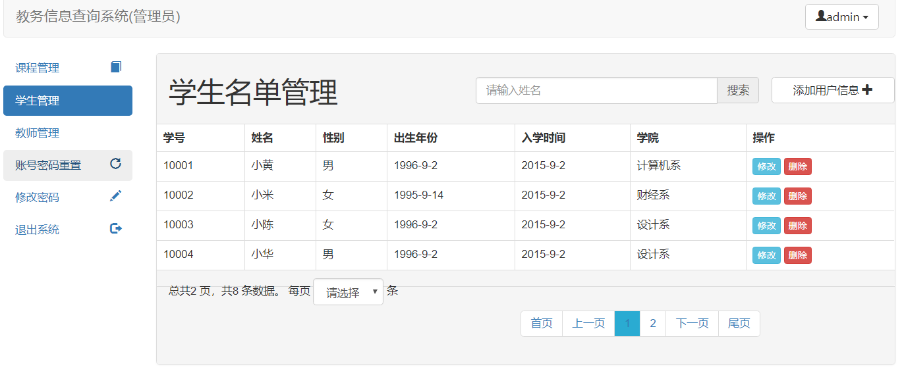
* **按照名字模糊查找学生信息：**
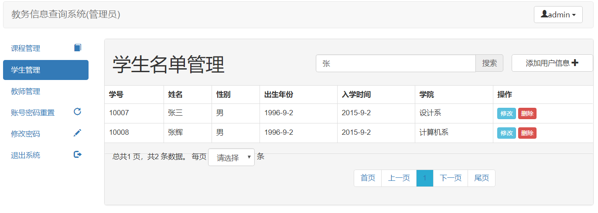
* **添加学生信息：**
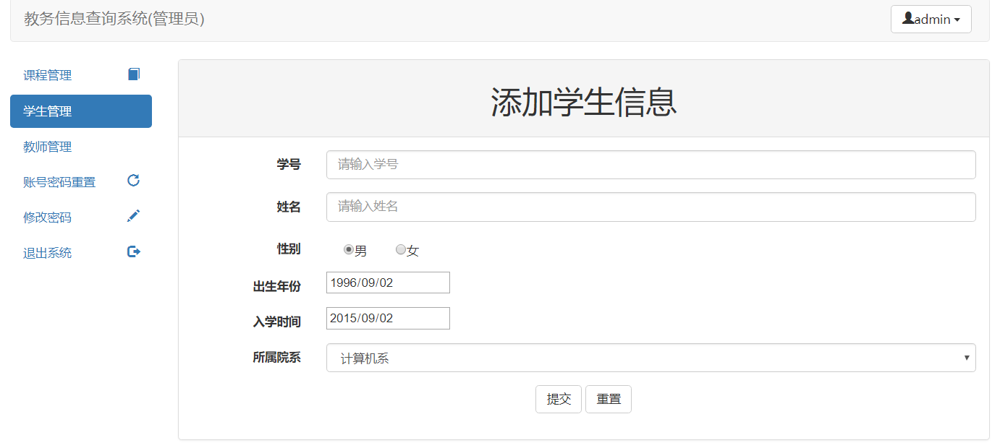
* **修改学生信息：**
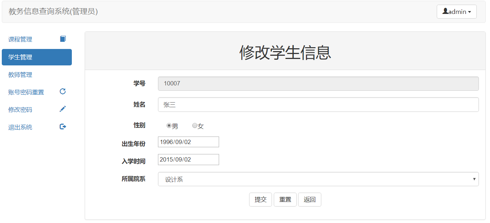
* **删除学生信息：**

* **修改学生或教师的密码：**
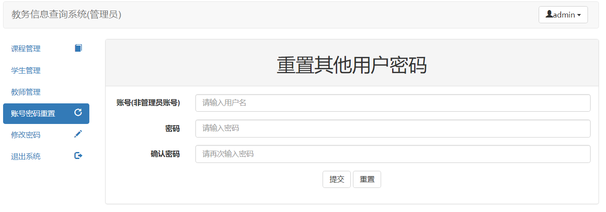
* **修改自己的密码：**
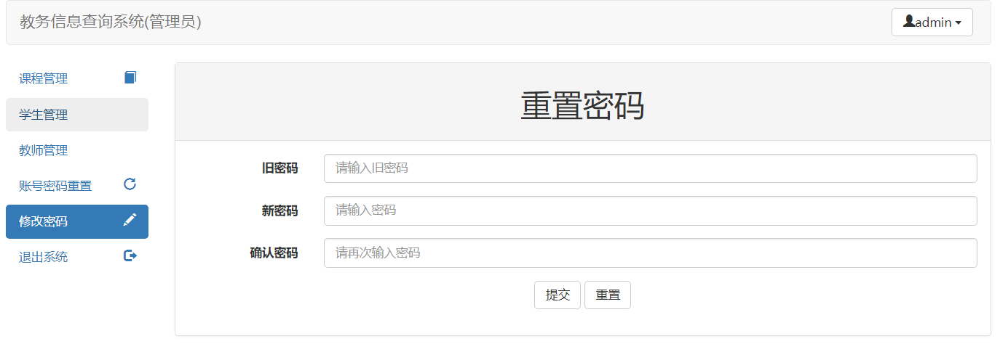

### 3、教师模块功能
教师登陆后，可以查看自己教授的课程，查询选修该课程的学生，对选修该课程的学生进行打分，修改个人密码
* **查看自己所教授的课程：**
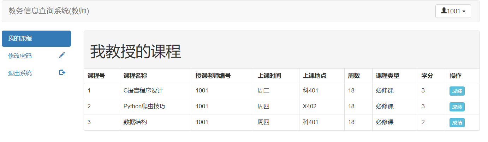
* **查询选修该课程的学生：**
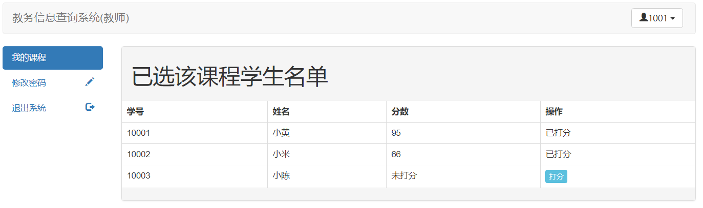
* **对选修该课程的学生进行打分：**
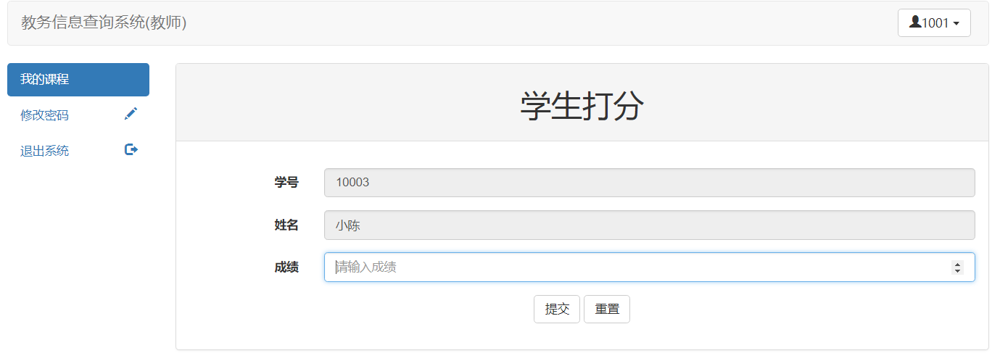
* **修改自己的密码：**
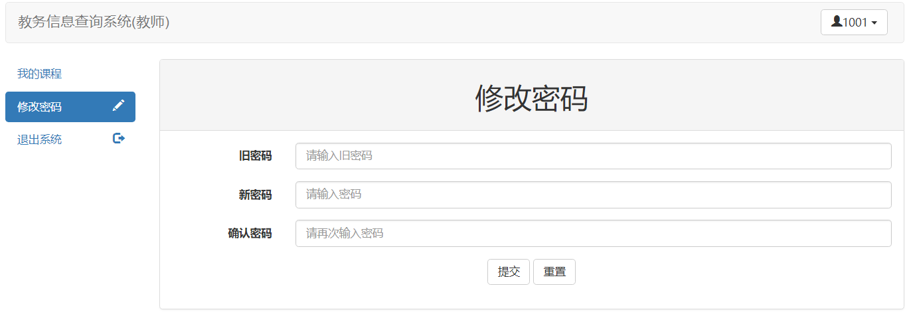

### 4、学生模块功能
学生登录后，可以进行选课，查看已修课程，查看已选课程，退选课程，修改个人密码
* **所有课程: 在这里选修课程，选好后，将会自动跳转到已选课程选项：**
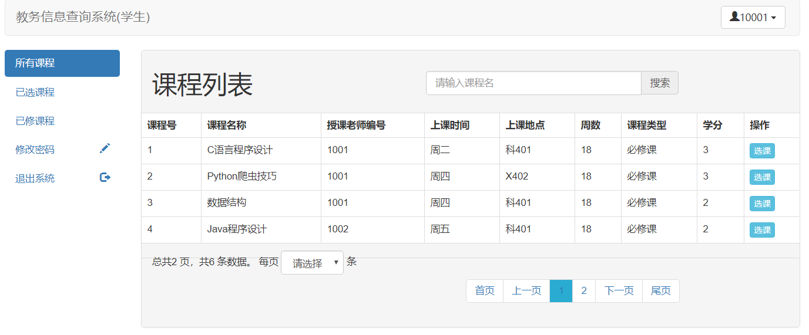
* **已选课程: 这里显示的是，还没修完的课程，也就是老师还没给成绩，由于还没有给成绩，所以这里可以进行退课操作：**
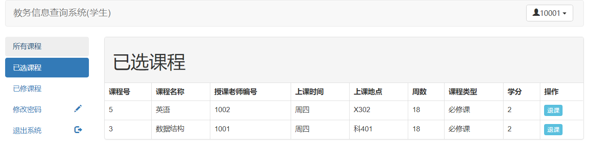
* **已修课程: 显示已经修完，老师已经给成绩的课程：**
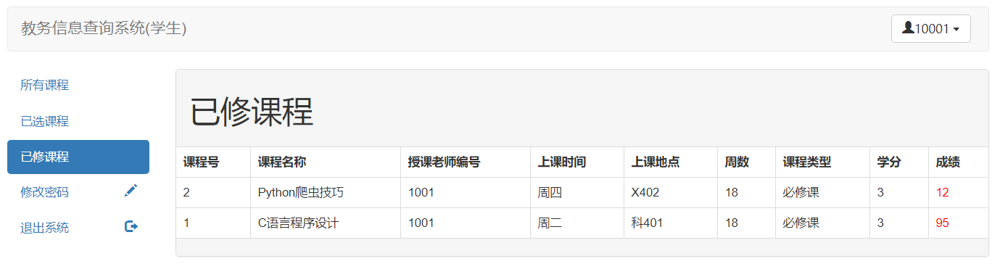